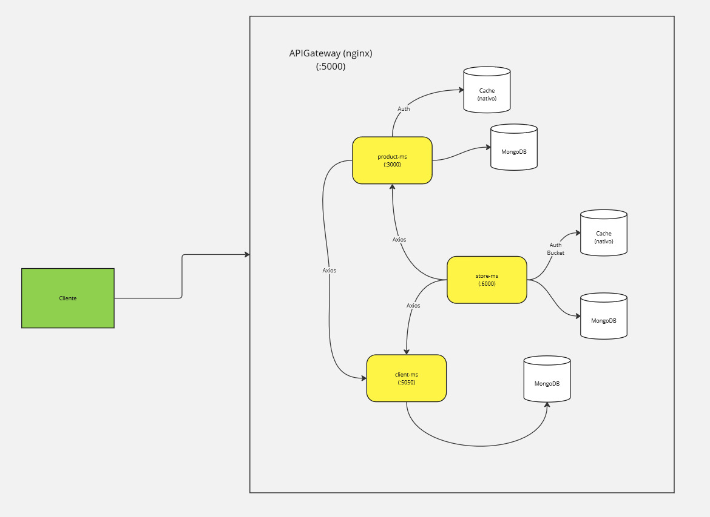

# DESAFIO BACKEND

## BACKEND STAR-STORE

## SUMMARY
    1. Introduction
    2. Instruction
    3. Documentation

## 1. Intruduction
### 1.1 Objectives
This project aims to meet the requirements of this challenge. 
The challenge has been divided into:
    a) Architecture;
    b) Infrastructure;
    c) Endpoints;
Each of these topics will be presented later.

## 2. Instructions
- To start the project, you need to run the following bash:
`$git submodule update --init --recursive`
- This project uses docker compose to run the submodule images. 
- To run the project, just do the following bash:
``$docker-compose up`
`$docker-compose run -d`

## 3. Documentation
### 3.1 Architecture
### 3.1 Architecture
- This project employs a microservices architecture, comprising three distinct services:
  - **Client Management (client-ms)**: Handles customer-related operations.
  - **Product Management (product-ms)**: Manages product information and inventory.
  - **Payment Processing (store-ms)**: Facilitates payment transactions.
- These microservices are unified under a single gateway, created with nginx, and respond on the same port (:5000), as illustrated below.
                                                

### 3.2 Infrastructure
- The infrastructure of this project consists of a gateway server created with nginx, which contains three microservices: client-ms for customer management, product-ms for product management, and store-ms for payment processing.
- Additionally, the project utilizes a cache structure native to the NestJS framework and a MongoDB database server for data storage.
- To facilitate deployment, the project leverages Docker to containerize the solutions, ensuring a more practical and efficient deployment process.

#### a) Docker-compose file
- This document explains the configuration of the docker-compose.yaml file for deploying the Star Store's microservices architecture. The services are configured to run in a custom Docker network with static IP addresses. Below is a detailed description of each service and the associated network setup.
##### Services

###### 1. **NGINX Gateway**

- **Image**: `nginx:latest`
- **Container Name**: `nginx_gateway`
- **Ports**: Maps `5000:5000` (listens on port `5000` for external access).
- **Volumes**: Mounts `nginx.conf` to `/etc/nginx/nginx.conf`.
- **Dependencies**:
  - `mongo`
  - `products-ms`
  - `client-ms`
- **Networks**: Uses `custom_network` with a static IP `192.168.100.10`.

###### 2. **MongoDB**

- **Image**: `mongo:latest`
- **Container Name**: `mongo_starstore`
- **Ports**: Maps `27017:27017` for database access.
- **Volumes**:
  - `./data:/data/db`
  - `./logs:/var/log/mongodb`
- **Command**: Configures logging to `./var/log/mongodb/mongodb.log`.
- **Networks**: Uses `custom_network` with a static IP `192.168.100.3`.

###### 3. **RabbitMQ**

- **Image**: `rabbitmq:3.9-management`
- **Container Name**: `rabbitmq_starstore`
- **Ports**:
  - `5672:5672` (AMQP protocol).
  - `15672:15672` (management console).
- **Networks**: Uses `custom_network` with a static IP `192.168.100.8`.

###### 4. **Products Microservice**

- **Build Context**: `./dev-produtcs-ms`
- **Ports**: Maps `3000:3000`.
- **Environment Variables**:
  - `MONGODB_URI`: `mongodb://mongo_starstore:27017/products-db`
  - `CLIENT_URL`: `http://192.168.100.5:5050/clients`
  - `RABBITMQ_URL`: `amqp://rabbitmq_starstore:5672`
- **Dependencies**:
  - `mongo`
  - `rabbitmq`
- **Networks**: Uses `custom_network` with a static IP `192.168.100.4`.

###### 5. **Clients Microservice**

- **Build Context**: `./dev-client-ms`
- **Ports**: Maps `5050:5050`.
- **Environment Variables**:
  - `MONGODB_URI`: `mongodb://mongo_starstore:27017/clients-db`
  - `URL_VIACEP`: `https://viacep.com.br`
- **Dependencies**:
  - `mongo`
- **Networks**: Uses `custom_network` with a static IP `192.168.100.5`.

###### 6. **Store Microservice**

- **Build Context**: `./dev-store-ms`
- **Ports**: Maps `6000:6000`.
- **Environment Variables**:
  - `MONGODB_URI`: `mongodb://mongo_starstore:27017/store-db`
  - `PRODUCT_URL`: `http://192.168.100.4:3000/products`
  - `CLIENT_URL`: `http://192.168.100.5:5050/clients`
  - `URL_PAYMENT`: `https://run.mocky.io/v3/232283f0-b58e-4c70-95fc-efe58b1e5627`
  - `RABBITMQ_URL`: `amqp://rabbitmq_starstore:5672`
- **Dependencies**:
  - `mongo`
  - `rabbitmq`
- **Networks**: Uses `custom_network` with a static IP `192.168.100.6`.

##### Networks

###### Custom Network

- **Driver**: `bridge`
- **Subnet**: `192.168.100.0/24`

This network ensures that all services can communicate with each other using their assigned static IPs.

## Notes

- The commented-out Redis service can be activated if caching is required.
- Ensure all build contexts and paths are correct relative to the `docker-compose.yaml` file.
- Use static IPs judiciously to avoid conflicts.
- Services like RabbitMQ and MongoDB should be secured if exposed to external networks.

This configuration is designed to support a scalable and efficient microservices architecture for the Star Store project.

#### b) Nginx Server
The file defines how NGINX functions as a reverse proxy to route incoming HTTP requests to the appropriate microservices based on the URL paths.

##### Overview

- **Worker Processes**: `1` (configures the number of worker processes for handling requests).
- **Worker Connections**: `1024` (maximum simultaneous connections per worker).
- **Keepalive Timeout**: `65` seconds.
- **Default MIME Type**: `application/octet-stream`.

##### HTTP Configuration
###### MIME Types

- Includes MIME types for file handling.
- Default type is set to `application/octet-stream`.

###### Server Configuration

The NGINX server listens on port `5000` and routes requests to various Star Store microservices based on predefined URL paths.

##### Routes

###### 1. **Products Microservice**

- **Path**: `/starstore/products/`
- **Proxy Target**: `http://192.168.100.4:3000/`
- **Headers**:
  - `Host`: `$host`
  - `X-Real-IP`: `$remote_addr`
  - `X-Forwarded-For`: `$proxy_add_x_forwarded_for`
  - `X-Forwarded-Proto`: `$scheme`
- **Rewrite Rule**:
  - Strips `/starstore/products/` from the incoming request path before forwarding to the microservice.
  - Example: `/starstore/products/item` becomes `/item`.

###### 2. **Clients Microservice**

- **Path**: `/starstore/clients/`
- **Proxy Target**: `http://192.168.100.5:5050/`
- **Headers**:
  - `Host`: `$host`
  - `X-Real-IP`: `$remote_addr`
  - `X-Forwarded-For`: `$proxy_add_x_forwarded_for`
  - `X-Forwarded-Proto`: `$scheme`
- **Rewrite Rule**:
  - Strips `/starstore/clients/` from the incoming request path before forwarding to the microservice.
  - Example: `/starstore/clients/info` becomes `/info`.

###### 3. **Store Microservice**

- **Path**: `/starstore/store/`
- **Proxy Target**: `http://192.168.100.6:6000/`
- **Headers**:
  - `Host`: `$host`
  - `X-Real-IP`: `$remote_addr`
  - `X-Forwarded-For`: `$proxy_add_x_forwarded_for`
  - `X-Forwarded-Proto`: `$scheme`
- **Rewrite Rule**:
  - Strips `/starstore/store/` from the incoming request path before forwarding to the microservice.
  - Example: `/starstore/store/order` becomes `/order`.

##### Key Notes

- Ensure that the IP addresses and ports configured in `proxy_pass` match the actual service addresses.
- All routes are designed to handle RESTful API requests and forward them seamlessly to the backend services.
- Headers are configured to provide information about the original request to the backend services.
- Rewrite rules ensure that the microservices receive clean paths without unnecessary prefixes.

##### Additional Considerations

- The number of worker processes and connections can be adjusted based on expected traffic.
- SSL termination can be added if HTTPS support is required.
- Logging and error handling configurations can be enhanced for better monitoring and debugging.

This configuration ensures an efficient and scalable routing mechanism for the Star Store microservices.

### 3.3 Endpoints

- Below, we have the endpoints of each microservice:

#### a) Login

##### Description

The `POST /clients/auth` endpoint is used to authenticate a client. The request should include the client's name and password in the request body. Upon successful authentication, the server responds with a JSON object containing an access token.
##### Request 

- Methode: `POST`

- URL:`http://localhost:5000/starstore/clients/auth`

##### Request Body

- `clientName`: (string) The name of the client.
    
- `password`: (string) The password for the client's account.
    

##### Response

The response is a JSON object with the following schema:

``` json
{
  "type": "object",
  "properties": {
    "access_token": {
      "type": "string"
    }
  }
}

 ```

##### Authorization
Bearer Token Authentication
The API uses Bearer Token authentication to secure endpoints. To access protected routes, include the access token in the `Authorization` header of your requests.

Example:

` Authorization: Bearer <access_token> `

Replace `<access_token>` with the actual token obtained during the authentication process.

#### b) GetClients
##### Description
This endpoint makes an HTTP GET request to retrieve client information from the StarStore API. The request does not include a request body, and the response is in JSON format with a status code of 200.
##### Request 

- Methode: `GET`

- URL:`http://localhost:5000/starstore/clients`

##### Response

The response body is a JSON object with the following schema:

```json
{
    "data": [
        {
            "id": "integer",
            "fullName": "string",
            "clientName": "string",
            "clientType": "string",
            "email": "string",
            "password": "string",
            "zipCode": "string"
        }
    ],
    "message": "string",
    "statusCode": "integer"
}
```
##### Authorization
Bearer Token Authentication
The API uses Bearer Token authentication to secure endpoints. To access protected routes, include the access token in the `Authorization` header of your requests.

Example:

` Authorization: Bearer <access_token> `

Replace `<access_token>` with the actual token obtained during the authentication process.

#### c) RegisterClient

##### Description

This endpoint is a POST request used to create a new client. The request should include the following parameters in the raw request body.

##### Request 

- Methode: `POST`

- URL:`http://localhost:5000/starstore/clients`

##### Request Body
- `fullName` (string): The full name of the client.
    
- `clientName` (string): The client's username.
    
- `clientType` (string): The type of client, e.g., buyer or seller.
    
- `email` (string): The email address of the client.
    
- `password` (string): The password for the client's account.
    
- `zipCode` (string): The client's zip code.
    
##### Response

The response of this request is documented as a JSON schema:

``` json
{
    "fullName" : "string",
    "clientName" : "string",
    "clientType": "string",
    "email": "string",
    "password" : "string",
    "zipCode": "string"
}

 ```


#### d)GetClientByID

##### Description

This endpoint is a GET request used to retrieve a client by ID.

##### URL

`http://localhost:5000/starstore/clients/{id}`

##### Response

The response of this request is documented as a JSON schema:
```json
{
    "fullName": "string",
    "clientName": "string",
    "clientType": "string",
    "email": "string",
    "password": "string",
    "zipCode": "string"
}
```
##### Authorization
Bearer Token Authentication
The API uses Bearer Token authentication to secure endpoints. To access protected routes, include the access token in the `Authorization` header of your requests.

Example:

` Authorization: Bearer <access_token> `

Replace `<access_token>` with the actual token obtained during the authentication process.

#### e) RegisterProduct

##### Description

This endpoint allows the client to add a new product to the store.

##### Request 

- Methode: `POST`

- URL:`http://localhost:5000/starstore/products`

##### Request Body

- title (string, required): The title of the product.
    
- price (number, required): The price of the product.
    
- thumbnail (string, required): The thumbnail image of the product.
    
- client_id (string, required): The client ID associated with the product.
    

##### Response 

The response for this request is a JSON object with the following schema:

``` json
{
  "title": "",
  "price": 0,
  "thumbnailHd": "",
  "date": "",
  "seller": {
    "client_name": "",
    "zipCode": "",
    "_id": ""
  },
  "_id": "",
  "__v": 0
}

 ```
##### Authorization
Bearer Token Authentication
The API uses Bearer Token authentication to secure endpoints. To access protected routes, include the access token in the `Authorization` header of your requests.

Example:

` Authorization: Bearer <access_token> `

Replace `<access_token>` with the actual token obtained during the authentication process.

#### f) GetProductByIdProduct

##### Description

This endpoint retrieves product details by making an HTTP GET request to {{STARSTORE_URL}}/products/product/{{productId}}.
##### Request 

- Methode: `GET`

- URL:`http://localhost:5000/starstore/products/{{productId}}`

##### Response

Upon a successful execution, the endpoint returns a JSON object with the following fields:

- `_id`: The unique identifier for the product.
    
- `title`: The title of the product.
    
- `price`: The price of the product.
    
- `thumbnailHd`: The URL for the high definition thumbnail image of the product.
    
- `date`: The date associated with the product.
    
- `seller`: An object containing details about the seller, including `client_name`, `zipCode`, and `_id`.
    
- `__v`: Version control field for the product.
    

In the response, the values for the fields will be populated with the respective product details.

##### Authorization
Bearer Token Authentication
The API uses Bearer Token authentication to secure endpoints. To access protected routes, include the access token in the `Authorization` header of your requests.

Example:
```
Authorization: Bearer <access_token>
```
Replace `<access_token>` with the actual token obtained during the authentication process.

#### g) GetProductList
##### Description 

The request retrieves product information from the StarStore API. 

##### Request

- Methode: `GET`

- URL:`http://localhost:5000/starstore/products/`

##### Authorization
Bearer Token Authentication
The API uses Bearer Token authentication to secure endpoints. To access protected routes, include the access token in the `Authorization` header of your requests.

Example:
```
Authorization: Bearer <access_token>
```
Replace `<access_token>` with the actual token obtained during the authentication process.

##### Response

 The response is a JSON array containing objects with the following properties:

- `_id` (string): The unique identifier of the product.
    
- `title` (string): The title or name of the product.
    
- `price` (number): The price of the product.
    
- `thumbnailHd` (string): The URL for the high-definition thumbnail image of the product.
    
- `date` (string): The date associated with the product.
    
- `seller` (object): An object containing details about the seller, including:
    
    - `client_name` (string): The name of the seller.
        
    - `zipCode` (string): The zip code of the seller.
        
    - `_id` (string): The unique identifier of the seller.
        
- `__v` (number): Version key for the product.

```json
[
  {
    "_id": "",
    "title": "",
    "price": 0,
    "thumbnailHd": "",
    "date": "",
    "seller": {
      "client_name": "",
      "zipCode": "",
      "_id": ""
    },
    "__v": 0
  }
]
```

**Example Response**

```json
[
  {
    "_id": "1234567890",
    "title": "Product A",
    "price": 19.99,
    "thumbnailHd": "https://example.com/product-a.jpg",
    "date": "2022-01-01",
    "seller": {
      "client_name": "John Doe",
      "zipCode": "12345",
      "_id": "seller-123"
    },
    "__v": 1
  },
  {
    "_id": "9876543210",
    "title": "Product B",
    "price": 9.99,
    "thumbnailHd": "https://example.com/product-b.jpg",
    "date": "2022-02-01",
    "seller": {
      "client_name": "Jane Doe",
      "zipCode": "67890",
      "_id": "seller-456"
    },
    "__v": 1
  }
]
```

#### h) AddProductToTheBucket
##### Description

- This endpoint retrieves the details of a specific product for a client from the store.

##### Request

- Method: GET
    
- URL: `http://localhost:5000/store/bucket/client/{{CLIENT_ID}}/product/{{PRODUCT_ID}}`
    

##### Response

The response for this request can be represented using the following JSON schema:

``` json
{
    "type": "object",
    "properties": {
        "client": {
            "type": "object",
            "properties": {
                "client_name": {
                    "type": "string"
                }
            }
        },
        "productList": {
            "type": "array",
            "items": {
                "type": "object",
                "properties": {
                    "price": {
                        "type": "number"
                    },
                    "title": {
                        "type": "string"
                    }
                }
            }
        },
        "totalPrice": {
            "type": "number"
        }
    }
}

 ```
#### i) GetBucketList

This endpoint retrieves the bucket information for a specific client.

##### Request

- Method: GET
    
- URL: `http://localhost:5000/store/bucket/client/{{CLIENT_ID}}`
    

#### Response

The response for this request is in JSON format.


``` json
{
    "client": {
        "type": "object",
        "properties": {
            "client_name": {
                "type": "string"
            },
            "zipCode": {
                "type": "string"
            }
        }
    },
    "productList": {
        "type": "array",
        "items": {
            "type": "object",
            "properties": {
                "price": {
                    "type": "number"
                },
                "title": {
                    "type": "string"
                }
            }
        }
    },
    "totalPrice": {
        "type": "number"
    }
}

 ```

